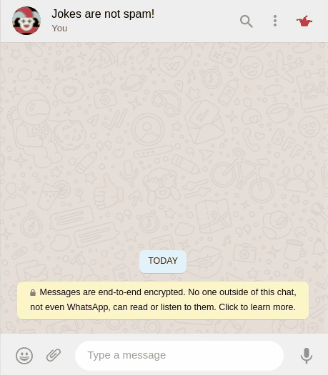

# WhatsApp Web Joker

This Chrome Extension adds a button by which you can send a random joke to your friends.

## Install

1. Download project
2. Enable developer mode in Chrome
3. Load unpacked project in Chrome

## Inspiration

Everyone has that awesome friend who sends a lot of jokes in WhatsApp. In order to be able to compete with I got
inspired to simplify this process. Mike, you are true inspiration sometimes.

## Credits

[Awesome joker](https://www.flaticon.com/de/autoren/monkik)
[One more awesome joker](https://www.freepik.com)
